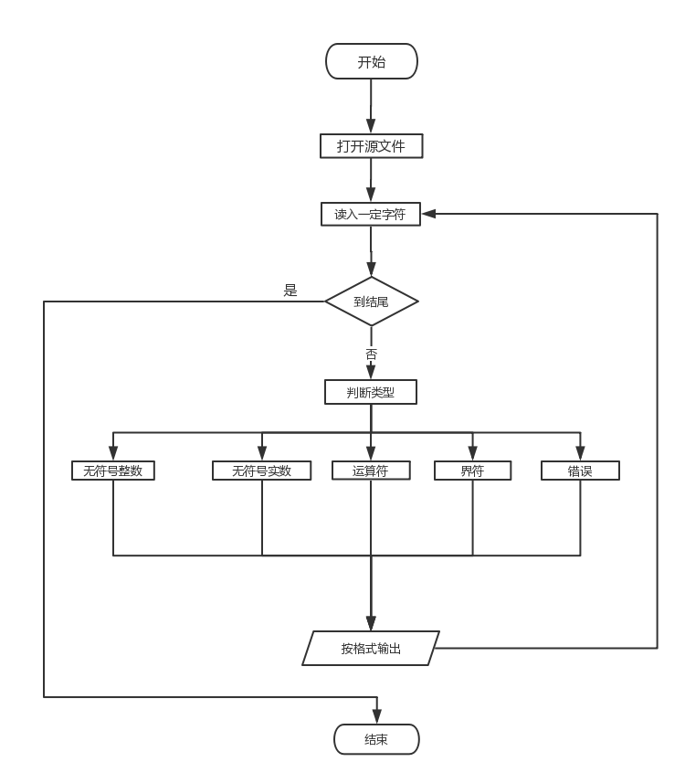

# 【实验】算术表达式

## 一、词法分析

### 1. 定义词法规则

定义表达式语言词法规则，用EBNF/文法/正规式表示；

#### EBNF

1. \<无符号整数> : : = \<数字>{\<数字>}

2. \<无符号实数> : : =  \<数字>{\<数字>}'.'\<数字>{\<数字>}
3. \<数字> : : = '0' | '1' | '2' | '3' | '4' | '5' | '6' | '7' | '8' | '9'
4. \<运算符> : : = '+' | '-' | '\*' | '/'
5. \<界符> : : = '(' | ')'  

### 2. 状态转换图

为文法中各类单词符号作出状态转换图；


### 3. 扫描程序框图

根据状态转换图，得到各类单词的扫描程序框图；



### 4. 出错处理

考虑出错处理的出口；

#### 词法错误类型

- 词法中未定义的字符及任何不符合词法单元定义的字符。
- 此例中不合法的单词，如字母等非法字符。

### 5. 设计并实现词法分析程序

#### 词法分析表：

| 类型type            | 单词记号token     | 单词种别symbol | 种别码 |
| ------------------- | ----------------- | -------------- | ------ |
| 1    Constant 常数  | <INTEGER_LITERAL> | INTEGER        | 0      |
|                     | <REAL_LITERAL>    | REAL           | 1      |
| 2   Operator 运算符 | +                 | PLUS           | 2      |
|                     | -                 | MINUS          | 3      |
|                     | *                 | TIMES          | 4      |
|                     | /                 | DIVIDE         | 5      |
| 3  Delimiter 界符   | (                 | LEFT_BRA       | 6      |
|                     | )                 | RIGHT_BRA      | 7      |

再加上出错类型：ERROR。

#### 全局变量

- sym 传递单词种别
- num传递无符号整数或无符号实数单词自身的值，即其数值

### 6. 设计典型用例并测试

#### 测试目标

能正确识别给定字符串中合法单词；能对不合法的字符报错。

#### 测试用例

- 正确用例：
  - 2+3\*6+2.5/7
  - -3+3\*(4.2+5)+7/4
  - 2.0+3
  - +++3
- 错误用例：含有不合法的字符
  - 32!
  - 23.3.45
  - ae34
  - 3>2
  - -fere}
  - 20..
  - 20.+

#### 预期结果

词法分析结果打印格式：(种别码, Token)

- 正确用例：

  - 2+3\*6+2.5/7：

    ```
    (0, 2)
    (2, +)
    (0, 3)
    (4, *)
    (0, 6)
    (2, +)
    (1, 2.5)
    (5, /)
    (0, 7)
    ```

  - -3+3\*(4.2+5)+7/4：

    ```
    (3, -)
    (0, 3)
    (2, +)
    (0, 3)
    (4, *)
    (6, ()
    (1, 4.2)
    (2, +)
    (0, 5)
    (7, ))
    (2, +)
    (0, 7)
    (5, /)
    (0, 4)
    ```

  - 2.0+3

    ```
    (1, 2.0)
    (2, +)
    (0, 3)
    ```

  - +++3

    ```
    (2, +)
    (2, +)
    (2, +)
    (0, 3)
    ```

- 错误用例：含有不合法的字符

  - 32!

    ```
    (0, 32)
    含有不合法字符：'!'
    ```

  - 23.3.45

    ```
    (1, 23.3)
    含有不合法字符：'.'
    (0, 45)
    ```

  - ae34

    ```
    含有不合法字符：'a'
    含有不合法字符：'e'
    (0, 34)
    ```

  - 3>2

    ```
    (0, 3)
    含有不合法字符：'>'
    (0, 2)
    ```

  - -fere}

    ```
    (3, -)
    含有不合法字符：'f'
    含有不合法字符：'e'
    含有不合法字符：'r'
    含有不合法字符：'e'
    含有不合法字符：'}'
    ```

  - 20..

    ```
    (0, 20)
    含有不合法字符：'.'
    含有不合法字符：'.'
    ```

  - 20.+

    ```
    (0, 20)
    含有不合法字符：'.'
    (2, +)
    ```

## 二、语法分析

使用自顶向下递归子程序的方法实现语法分析。

### 1. 定义语法规则

- EXP —> TERM + EXP | TERM - EXP | TERM
- TERM —> FACTOR * TERM | factor/TERM | FACTOR
- FACTOR—> DIGIT ｜(EXP)
- DIGIT -> (0|1|2|3|4|5|6|7|8|9)

### 2. 语法树


### 3. 扫描程序框图


### 4. 设计典型用例并测试

#### 测试目标

能分析所有的token，并画出对应的语法树；对于不符合规则的语法错误进行报错。

#### 测试用例及预期结果

语法分析结果打印格式：横向排布的语法树，左子树在上、右子树在下。

##### 正确用例

1. 整数加减乘除：

- ```
  -2+3+41
  2+42-3
  +2+3-6
  24+3*5
  33-(12-3)+5
  4/2+51
  25*4-6/(3+4)-1
  2/3   
  2+((3+2)*6+3)/2 
  
  ----语法分析----
  第1行算数式分析结果：
                                                        ( 0 , Factor )
                                      ( - , Exp )
                                                        ( 2 , Factor )
                    ( + , Exp )
                                      ( 3 , Factor )
  ( + , Exp )
                    ( 41 , Factor )
  
  第2行算数式分析结果：
                                      ( 2 , Factor )
                    ( + , Exp )
                                      ( 42 , Factor )
  ( - , Exp )
                    ( 3 , Factor )
  
  第3行算数式分析结果：
                                                        ( 0 , Factor )
                                      ( + , Exp )
                                                        ( 2 , Factor )
                    ( + , Exp )
                                      ( 3 , Factor )
  ( - , Exp )
                    ( 6 , Factor )
  
  第4行算数式分析结果：
                    ( 24 , Factor )
  ( + , Exp )
                                      ( 3 , Factor )
                    ( * , Term )
                                      ( 5 , Factor )
  
  第5行算数式分析结果：
                                      ( 33 , Factor )
                    ( - , Exp )
                                                        ( 12 , Factor )
                                      ( - , Exp )
                                                        ( 3 , Factor )
  ( + , Exp )
                    ( 5 , Factor )
  
  第6行算数式分析结果：
                                      ( 4 , Factor )
  ```

2. 小数加减乘除：

   ```
   2.0+1.0
   2.3*(4.0-2.2)
   3.2/1.6+5.2
   3.3/2.1-2.0  
   6.1-(2.0+1.3)
   
   ----语法分析----
   第1行算数式分析结果：
                     ( 2.0 , Factor )
   ( + , Exp )
                     ( 1.0 , Factor )
   
   第2行算数式分析结果：
                     ( 2.3 , Factor )
   ( * , Term )
                                       ( 4.0 , Factor )
                     ( - , Exp )
                                       ( 2.2 , Factor )
   
   第3行算数式分析结果：
                                       ( 3.2 , Factor )
                     ( / , Term )
                                       ( 1.6 , Factor )
   ( + , Exp )
                     ( 5.2 , Factor )
   
   第4行算数式分析结果：
                                       ( 3.3 , Factor )
                     ( / , Term )
                                       ( 2.1 , Factor )
   ( - , Exp )
                     ( 2.0 , Factor )
   
   第5行算数式分析结果：
                     ( 6.1 , Factor )
   ( - , Exp )
                                       ( 2.0 , Factor )
                     ( + , Exp )
                                       ( 1.3 , Factor )
   ```

3. 实数加减乘除：

   ```
   2.0+1
   3/2+2.4
   0.5/2-2+5
   2.3/1.2*5
   
   ----语法分析----
   第1行算数式分析结果：
                     ( 2.0 , Factor )
   ( + , Exp )
                     ( 1 , Factor )
   
   第2行算数式分析结果：
                                       ( 3 , Factor )
                     ( / , Term )
                                       ( 2 , Factor )
   ( + , Exp )
                     ( 2.4 , Factor )
   
   第3行算数式分析结果：
                                                         ( .5 , Factor )
                                       ( / , Term )
                                                         ( 2 , Factor )
                     ( - , Exp )
                                       ( 2 , Factor )
   ( + , Exp )
                     ( 5 , Factor )
   
   第4行算数式分析结果：
                     ( 2.3 , Factor )
   ( / , Term )
                                       ( 1.2 , Factor )
                     ( * , Term )
                                       ( 5 , Factor )
   
   ```

##### 错误用例

1. 除以0：

   ```
   2/0
   0/0
   3.0/0
   0.0/0
   4/0.0
   5.2/0.0
   0/0.0
   
   ----语法分析----
   第1行算数式分析结果：
   Syntax Error : position (3) "0"不可作为除数
   第2行算数式分析结果：
   Syntax Error : position (3) "0"不可作为除数
   第3行算数式分析结果：
   Syntax Error : position (3) "0"不可作为除数
   第4行算数式分析结果：
   Syntax Error : position (3) "0"不可作为除数
   第5行算数式分析结果：
   Syntax Error : position (3) "0"不可作为除数
   第6行算数式分析结果：
   Syntax Error : position (3) "0"不可作为除数
   第7行算数式分析结果：
   Syntax Error : position (3) "0"不可作为除数
   ```

2. 符号错误：

   ```
   +
   /
   ++1
   1++
   1++2
   3--54
   6**2
   2*
   /3 
   4..2+1
   23.3.4+1
   
   ----语法分析----
   第1行算数式分析结果：
   Syntax Error : position (1) 运算符后无运算数
   第2行算数式分析结果：
   Syntax error: 运算符前无被运算数
   第3行算数式分析结果：
   Syntax Error : position (2) 符号重叠
   第4行算数式分析结果：
   Syntax Error : position (3) 运算符后无运算数
   第5行算数式分析结果：
   Syntax Error : position (3) 符号重叠
   第6行算数式分析结果：
   Syntax Error : position (3) 符号重叠
   第7行算数式分析结果：
   Syntax Error : position (3) 符号重叠
   第8行算数式分析结果：
   Syntax Error : position (2) 运算符后无运算数
   第9行算数式分析结果：
   Syntax error: 运算符前无被运算数
   第10行算数式分析结果：
   Lexical Error!
   第11行算数式分析结果：
   Lexical Error!
   ```

3. 未知的字符：

   ```
   2\1 		
   3#67		
   32!			
   3>2 		
   -fere} 
   
   ----语法分析----
   第1行算数式分析结果：
   Lexical Error!
   第2行算数式分析结果：
   Lexical Error!
   第3行算数式分析结果：
   Lexical Error!
   第4行算数式分析结果：
   Lexical Error!
   第5行算数式分析结果：
   Lexical Error!
   ```

4. 括号不匹配：

   ```
   2+3-(4-7+6+5
   1+2)*4
   2+((3+2)*6+3/2 
   2+(3+2)*6+3)/2 
   
   ----语法分析----
   第1行算数式分析结果：
   Syntax Error : position (12) 右括号缺失
                                       ( 2 , Factor )
                     ( + , Exp )
                                       ( 3 , Factor )
   ( - , Exp )
                                                                           ( 4 , Factor )
                                                         ( - , Exp )
                                                                           ( 7 , Factor )
                                       ( + , Exp )
                                                         ( 6 , Factor )
                     ( + , Exp )
                                       ( 5 , Factor )
   
   第2行算数式分析结果：
   Syntax Error : position (4)  右括号冗余 
                     ( 1 , Factor )
   ( + , Exp )
                                       ( 2 , Factor )
                     ( * , Term )
                                       ( 4 , Factor )
   
   第3行算数式分析结果：
   Syntax Error : position (14) 右括号缺失
                     ( 2 , Factor )
   ( + , Exp )
                                                                           ( 3 , Factor )
                                                         ( + , Exp )
                                                                           ( 2 , Factor )
                                       ( * , Term )
                                                         ( 6 , Factor )
                     ( + , Exp )
                                                         ( 3 , Factor )
                                       ( / , Term )
                                                         ( 2 , Factor )
   
   第4行算数式分析结果：
   Syntax Error : position (12)  右括号冗余 
                                       ( 2 , Factor )
                     ( + , Exp )
                                                                           ( 3 , Factor )
                                                         ( + , Exp )
                                                                           ( 2 , Factor )
                                       ( * , Term )
                                                         ( 6 , Factor )
   ( + , Exp )
                                       ( 3 , Factor )
                     ( / , Term )
                                       ( 2 , Factor )
   ```

5. 错误使用代码

   ```
   (
   )+2
   7/(
   ()-4
   (-)
   (-9)0
   (-9)-
   2(-9)
   2-(--9)
   2+3-(4-)7+6+5
   (5/6)/
   2(9)
   
   ----语法分析----
   第1行算数式分析结果：
   Syntax Error : position (1) 算数式中仅有左括号
   第2行算数式分析结果：
   Syntax Error : position (1)  右括号位置错误 
                     ( 0 , Factor )
   ( + , Exp )
                     ( 2 , Factor )
   
   第3行算数式分析结果：
   Syntax Error: position (3) 括号不可单独作为运算数.
   第4行算数式分析结果：
   Syntax Error：position (2) 括号内为空！
                     ( 0 , Factor )
   ( - , Exp )
                     ( 4 , Factor )
   
   第5行算数式分析结果：
   Syntax Error : position (2)  运算符号前无被运算数 
   第6行算数式分析结果：
   Syntax Error : position (4)  右括号后不可直接运算 
   第7行算数式分析结果：
   Syntax Error : position (5) 运算符后无运算数
   第8行算数式分析结果：
   Syntax Error : position (2)  左括号位置错误 
   Syntax Error : position (5)  右括号冗余 
                     ( 2 , Factor )
   ( - , Exp )
                     ( 9 , Factor )
   
   第9行算数式分析结果：
   Syntax Error : position (5) 符号重叠
   第10行算数式分析结果：
   Syntax Error: position (8) 运算符后不可直接使用右括号.
   Syntax Error : position (13) 右括号缺失
                                       ( 2 , Factor )
                     ( + , Exp )
                                       ( 3 , Factor )
   ( - , Exp )
                                                                           ( 4 , Factor )
                                                         ( - , Exp )
                                                                           ( 7 , Factor )
                                       ( + , Exp )
                                                         ( 6 , Factor )
                     ( + , Exp )
                                       ( 5 , Factor )
   
   第11行算数式分析结果：
   Syntax Error : position (6) 运算符后无运算数
   第12行算数式分析结果：
   Syntax Error : position (2)  左括号前后都为数字不可进行运算 
   
   ```


## 三、 语义分析

算术表达式的语义分析就是算出算术表达式的结果。

### 设计典型用例并测试

#### 测试目标

由输入的语法树得到最后算术表达式的结果，并得到后缀表达式；对于不符合规则的错误进行报错。

#### 测试用例及预期结果

语法分析结果打印格式：打印两行分别是后缀表达式和计算结果。

##### 正确用例

1. 整数加减乘除：

   ```
   -2+3+41
   2+42-3
   +2+3-6
   24+3*5
   33-(12-3)+5
   4/2+51
   25*4-6/(3+4)-1
   2/3   
   2+((3+2)*6+3)/2 
   
   -----结果-----
   第1行算数式分析结果：
   后缀表达式是: 0 2 - 3 + 41 + 
   计算结果 : 42
   第2行算数式分析结果：
   后缀表达式是: 2 42 + 3 - 
   计算结果 : 41
   第3行算数式分析结果：
   后缀表达式是: 0 2 + 3 + 6 - 
   计算结果 : -1
   第4行算数式分析结果：
   后缀表达式是: 24 3 5 * + 
   计算结果 : 39
   第5行算数式分析结果：
   后缀表达式是: 33 12 3 - - 5 + 
   计算结果 : 29
   第6行算数式分析结果：
   后缀表达式是: 4 2 / 51 + 
   计算结果 : 53
   第7行算数式分析结果：
   后缀表达式是: 25 4 * 6 3 4 + / - 1 - 
   计算结果 : 98.14286
   第8行算数式分析结果：
   后缀表达式是: 2 3 / 
   计算结果 : 0.6666667
   第9行算数式分析结果：
   后缀表达式是: 2 3 2 + 6 * 3 + 2 / + 
   计算结果 : 18.5
   ```

2. 小数加减乘除：

   ```
   2.0+1.0
   2.3*(4.0-2.2)
   3.2/1.6+5.2
   3.3/2.1-2.0  
   6.1-(2.0+1.3)
   
   -----结果-----
   第1行算数式分析结果：
   后缀表达式是: 2.0 1.0 + 
   计算结果 : 3
   第2行算数式分析结果：
   后缀表达式是: 2.3 4.0 2.2 - * 
   计算结果 : 4.14
   第3行算数式分析结果：
   后缀表达式是: 3.2 1.6 / 5.2 + 
   计算结果 : 7.2
   第4行算数式分析结果：
   后缀表达式是: 3.3 2.1 / 2.0 - 
   计算结果 : -0.42857134
   第5行算数式分析结果：
   后缀表达式是: 6.1 2.0 1.3 + - 
   计算结果 : 2.8
   ```

3. 实数加减乘除：

   ```
   2.0+1
   3/2+2.4
   0.5/2-2+5
   2.3/1.2*5
   
   -----结果-----
   第1行算数式分析结果：
   后缀表达式是: 2.0 1 + 
   计算结果 : 3
   第2行算数式分析结果：
   后缀表达式是: 3 2 / 2.4 + 
   计算结果 : 3.9
   第3行算数式分析结果：
   后缀表达式是: .5 2 / 2 - 5 + 
   计算结果 : 3.25
   第4行算数式分析结果：
   后缀表达式是: 2.3 1.2 5 * / 
   计算结果 : 0.38333333
   ```

##### 错误用例

1. 除以0：

   ```
   2/0
   0/0
   3.0/0
   0.0/0
   4/0.0
   5.2/0.0
   0/0.0
   
   -----结果-----
   第1行算数式分析结果：
   Syntax error
   第2行算数式分析结果：
   Syntax error
   第3行算数式分析结果：
   Syntax error
   第4行算数式分析结果：
   Syntax error
   第5行算数式分析结果：
   Syntax error
   第6行算数式分析结果：
   Syntax error
   第7行算数式分析结果：
   Syntax error
   ```

2. 符号错误：

   ```
   +
   /
   ++1
   1++
   1++2
   3--54
   6**2
   2*
   /3 
   4..2+1
   23.3.4+1
   
   -----结果-----
   第1行算数式分析结果：
   Syntax error
   第2行算数式分析结果：
   Syntax error
   第3行算数式分析结果：
   Syntax error
   第4行算数式分析结果：
   Syntax error
   第5行算数式分析结果：
   Syntax error
   第6行算数式分析结果：
   Syntax error
   第7行算数式分析结果：
   Syntax error
   第8行算数式分析结果：
   Syntax error
   第9行算数式分析结果：
   Syntax error
   第10行算数式分析结果：
   Syntax Error!
   第11行算数式分析结果：
   Syntax Error!
   ```

3. 未知的字符：

   ```
   2\1 		
   3#67		
   32!			
   3>2 		
   -fere} 
   
   -----结果-----
   第1行算数式分析结果：
   Syntax Error!
   第2行算数式分析结果：
   Syntax Error!
   第3行算数式分析结果：
   Syntax Error!
   第4行算数式分析结果：
   Syntax Error!
   第5行算数式分析结果：
   Syntax Error!
   ```

4. 括号不匹配：

   ```
   2+3-(4-7+6+5
   1+2)*4
   2+((3+2)*6+3/2 
   2+(3+2)*6+3)/2 
   
   -----结果-----
   第1行算数式分析结果：
   后缀表达式是: 2 3 + 4 7 - 6 + 5 + - 
   计算结果 : -3
   第2行算数式分析结果：
   后缀表达式是: 1 2 4 * + 
   计算结果 : 9
   第3行算数式分析结果：
   后缀表达式是: 2 3 2 + 6 * 3 2 / + + 
   计算结果 : 33.5
   第4行算数式分析结果：
   后缀表达式是: 2 3 2 + 6 * + 3 2 / + 
   计算结果 : 33.5
   ```

5. 错误使用括号

   ```
   (
   )+2
   7/(
   ()-4
   (-)
   (-9)0
   (-9)-
   2(-9)
   2-(--9)
   2+3-(4-)7+6+5
   (5/6)/
   2(9)
   
   -----结果-----
   第1行算数式分析结果：
   Syntax error
   第2行算数式分析结果：
   后缀表达式是: 0 2 + 
   计算结果 : 2
   第3行算数式分析结果：
   Syntax error
   第4行算数式分析结果：
   后缀表达式是: 0 4 - 
   计算结果 : -4
   第5行算数式分析结果：
   Syntax error
   第6行算数式分析结果：
   Syntax error
   第7行算数式分析结果：
   Syntax error
   第8行算数式分析结果：
   后缀表达式是: 2 9 - 
   计算结果 : -7
   第9行算数式分析结果：
   Syntax error
   第10行算数式分析结果：
   后缀表达式是: 2 3 + 4 7 - 6 + 5 + - 
   计算结果 : -3
   第11行算数式分析结果：
   Syntax error
   第12行算数式分析结果：
   Syntax error
   ```


