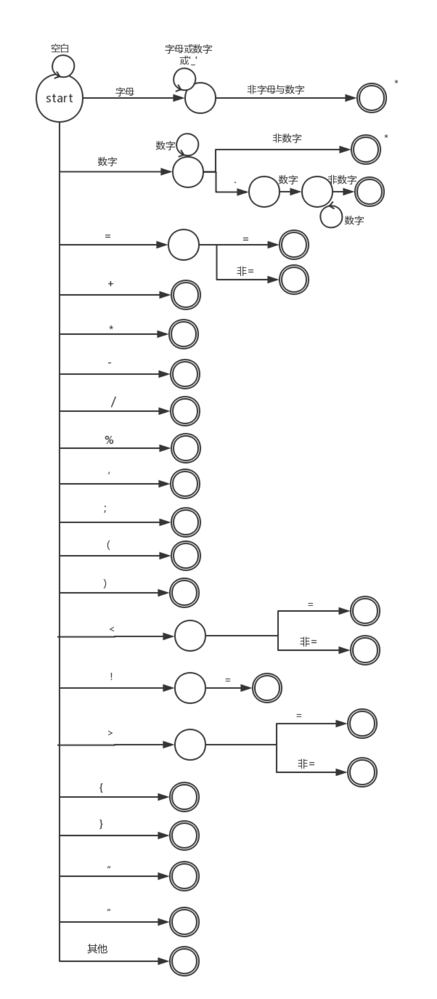

# 解释器构造实验

## 介绍工具和语言

### antlr

  ANTLR是ANother Tool for Language Recognition的缩写“又一个语言识别工具”。从名字上可以看出在ANTLR出现之前已经存在其它语言识别工具了（如LEX，YACC。ANTLR的官方定义为：根据一种可以嵌入如Java, C++或C#等辅助代码段的文法，来构筑出相对该文法的识别器，编译器或翻译器的一种语言工具框架。这个定义说明了ANTLR的功能是根据给定文法自动生成编译器，其过程为先编写相应语言的文法然后生成相应语言编译器。定义提到的语言识别器，编译器和翻译器我们以后统称为语法分析器。事实上ANTLR是生成相应语言编译器的源代码，我们还需要编译它。那么ANTLR可以生成哪些方语言的语法分析器源代码语言的代码呢？这是程序员很关心的问题。幸运的是ANTLR现在已经支持了多种当前流行的开发语言，包括Java、C#、C、C++、Objective-C、Python和 Ruby.1等。其结构如下图所示：


由上图可以看出，ANTLR的基本结构分为ANTLR文法、ANTLR Runtime两部分，其中ANTLR Runtime包含java、C#、C、C++等许多语言的解析编译引擎，在实际使用的时候可以根据需要生成其中任何一种语言的语法分析器。

ANTLR的具体处理过程:在使用ANTLR解析文本的时候，先编辑ANTLR文法文件（以.g为后缀的文件），在里面定义好词法分析和语义分析的相关规则，然后利用ANTLR Runtime来根据所选定的语言来生成所对应语言的文件，例如java语言，则生成java语言所对应的java类，最后在需要时直接调用生成的类来对指定的文本进行解析即可。从编译器的角度来看，Antlr可以用来帮助我们完成编译器前端所需要完成的一些工作：词法分析（Lexer Analysis）、语法分析（Syntax Analysis）、生成抽象语法树（Abstract Syntax Tree, AST）等等。语义分析（Semantic Analysis），例如类型检查，就需要我们自己来完成。

 要使用Antlr生成语言的词法分析器（Lexer）和语法分析器（Parser），我们需要告诉Antlr语言的文法（Grammar）。Antlr采用的是上下文无关文法（Context Free Grammar），使用类似BNF的符号集来描述。使用上下文无关文法的语言比较常用的Parser有两种，LL Parser和LR Parser，而Antlr帮我们生成的是前者。

#### 1、Listener (观察者模式，通过结点监听，触发处理方法)

- 程序员不需要显示定义遍历语法树的顺序，实现简单
- 缺点，不能显示控制遍历语法树的顺序
- 动作代码与文法产生式解耦，利于文法产生式的重用
- 没有返回值，需要使用map、栈等结构在节点间传值

#### 2、Visitor (访问者模式，主动遍历)

- 程序员可以显示定义遍历语法树的顺序
- 不需要与antlr遍历类ParseTreeWalker一起使用，直接对tree操作
- 动作代码与文法产生式解耦，利于文法产生式的重用
- visitor方法可以直接返回值，返回值的类型必须一致，不需要使用map这种节点间传值方式，效率高


具体实现方法：

https://www.jianshu.com/p/1f5e72156075

### CMM

为了实现解析器，我们使用ANTLR工具从设计的语法规则生成递归下降解析器。递归-下降解析器实际上只是递归方法的集合，每个规则一个。下降术语指的是解析从解析树的根开始，然后继续到叶子报告勘误表(令牌)。我们首先调用的规则start符号成为解析树的根。这意味着要为上一节中的解析树调用stat()方法。这种解析更一般的术语是自顶向下解析;递归-下降解析器只是一种自顶向下的解析器实现。

我们在ANTLR提供的运行时库中使用了两种树遍历机制。默认情况下，ANTLR生成一个解析树侦听器接口，该接口响应由内置的树行者触发的事件。方便的侦听器机制是自动的，这意味着我们不必编写解析树行者，侦听器方法也不必显式地访问它们的子方法。我们的主要工作是从父类继承并覆盖和补充它，以完成我们自己的语义分析部分和执行部分。我们的符号代码结构和设计细节如下图所示。我们还添加了警告和错误报告部分，使其健壮且友好。我们通过添加类型字符串和相应的操作来实现语法的类型。我们遇到的主要问题是类符号中固定的变量域冲突、循环逻辑、if-else、break函数、RefPahse和Defphase等。

在解析语义时还执行语义分析。对于所有变量，我们存储变量名，添加一个级别，以指示变量的作用域。在不同级别声明的变量属于相应级别，如果您离开层次结构，则应该删除在队列中声明层次结构变量的责任。

实现变量声明的逻辑是在相同的范围内检查是否存在重复变量，如果没有，则联接符号表。我们还检查变量是否声明，赋值类型的两边是否匹配，数组下标是否为整数。

在构建树的过程中，源代码和语法不同，然后抛出错误，使用错误和警告类。编译错误消息，终止编译和输出。该消息包含错误消息和行数。

## CMM语言定义

CMM（C Minus Minus／C- -）语言为C语言的一个子集，其基础定义如下：

- 语言结构：顺序结构（赋值语句=、输入read、输出write）、选择语句（if-else）、循环结构（while）。这些语句结构和C语言的结构一样，允许嵌套。
- 表达式局限于关系表达式和算术表达式，运算的优先级为：算术运算、关系运算，并服从左结合规则。
- 算术表达式包括整数和实数上的运算、变量及“()”、“\*”、“+”、“-”、“/”，“%”运算符的优先级顺序为：“()”，大于“*”和“/”和“%”，大于“+”和“-”。
- 关系运算符包括：“<”、“>”、“==”、“<>”、“<=”、“>=”。 
- 一条语句以“; ”结束；
- 可用逗号“, ”在一行内分隔多个语句。
- 程序由一条语句或者由“{”和“}”嵌套表达的复合语句。
- 支持多行注释（使用“/*”、“ */”和“//”）。
- 支持数组运算，数组的下标必须是正整数，使用“[”和“]”表示数组下标。
- 数组声明方式和Java一样，如，`int[]`。
- 变量的使用之前需要先声明，声明的方式和C语言一样。
- 十进制的整数类型int与实数类型double，布尔类型bool。
- 字符串类型string，字符串常量需要用双引号括起来，如`"This is a string."`。
- 标识符（由数字、字母和下划线组成的串，但必须以字母开头、且不能以下划线结尾的串）。	
- 无函数、类、对象的概念。

| 保留字 | 特殊符号 |
| ------ | -------- |
| if     | +        |
| else   | -        |
| while  | *        |
| read   | /        |
| write  | =        |
| int    | <        |
| double | >        |
| bool   | <=       |
| true   | >=       |
| false  | ==       |
|        | !=       |
|        | (        |
|        | )        |
|        | {        |
|        | }        |
|        | /*       |
|        | */       |
|        | //       |
|        | [        |
|        | ]        |
|        | ;        |
|        | ,        |
|        | "        |
|        | %        |

## 词法分析

#### 1. EBNF

1. \<数字> : : = '0' | '1' | '2' | '3' | '4' | '5' | '6' | '7' | '8' | '9'
2. <字母> : : =  ["a"-"z","A"-"Z"]
3. <无符号整数> : : = \<数字>{\<数字>}
4. <无符号实数> : : = \<数字>{\<数字>}'.'\<数字>{\<数字>}
5. <运算符> : : = '+' | '-' | '*' | '/' | '%' | '<' | '>' | '!=' | '==' |'=' | '<=' | '>='
6. \<界符> : : = '(' | ')' | '[' | ']' | '{' | '}' | ',' | ';'
7. \<标识符> : : = <字母> | <字母>（ <字母> | <数字> | '_' )* ( <字母> | <数字> ) 
8. \<关键字> : : = <"IF": if> | <"ELSE": else> | <"WHILE": while> | <"READ": read> | <"WRITE": write> | <"INT": int> | <"Double": double> | <"BOOL": bool> 
9. \<注释> : : = '//' | '/\*' | '*/' 

#### 2. 状态转换图



#### 3. 扫描程序框图


#### 4. 词法分析表

| 类型type            | 单词记号token     | 单词种别symbol | 种别码 |
| ------------------- | ----------------- | -------------- | ------ |
| 1    Constant 常数  | <INTEGER_LITERAL> | INTEGER        | 0      |
|                     | <DOUBLE_LITERAL>  | DOUBLE         | 1      |
| 2   Operator 运算符 | +                 | PLUS           | 2      |
|                     | -                 | MINUS          | 3      |
|                     | *                 | TIMES          | 4      |
|                     | /                 | DIVIDE         | 5      |
|                     | %                 | MOD            | 5      |
|                     | <                 | LESS           | 6      |
|                     | >                 | GREATER        | 7      |
|                     | <=                | LESS_EQUAL     | 8      |
|                     | \>=               | MORE_EQUAL     | 9      |
|                     | !=                | NOTEQUAL       | 10     |
|                     | ==                | EQUAL          | 11     |
|                     | =                 | ASSIGN         | 12     |
| 3  Delimiter 界符   | (                 | LEFT_PAR       | 13     |
|                     | )                 | RIGHT_PAR      | 14     |
|                     | [                 | LEFT_BRA       | 15     |
|                     | ]                 | RIGHT_BRA      | 16     |
|                     | {                 | LEFT_CUR       | 17     |
|                     | }                 | RIGHT_CUR      | 18     |
|                     | ,                 | COMMA          | 19     |
|                     | ;                 | SEMI           | 20     |
| 4 标识符            | \<IDENTIFIER>     | IDENTIFIER     | 21     |
| 5 关键字            | if                | IF             | 22     |
|                     | else              | ELSE           | 23     |
|                     | while             | WHILE          | 24     |
|                     | read              | READ           | 25     |
|                     | write             | WRITE          | 26     |
|                     | int               | INT            | 27     |
|                     | double            | DOUBLE         | 28     |
|                     | bool              | BOOL           | 29     |
| 6 注释              | //                | COMMENT        | 31     |
|                     | /*                | LEFT_COM       | 32     |
|                     | \*/               | RIGHT_COM      | 33     |
| 7 错误              |                   | ERROR          | 34     |

再加上出错类型：ERROR。


## 语法分析

### 1. EBNF

| 类型                     | 定义为 |                                                    |
| ------------------------ | ------ | -------------------------------------------------- |
| VarDeclaration           | ::=    | Type Identifier ";"                                |
| Type                     | ::=    | Identifier                                         |
|                          |        | \| BooleanType                                     |
|                          |        | \| IntegerType                                     |
|                          |        | \| DoubleType                                      |
|                          |        | \|  ArrayType                                      |
| ArrayType                | ::=    | "int" "[" "]"                                      |
| ==（与Java类似）==       |        | \| "double" "[" "]"                              |
|                          |        | \| "bool" "[" "]"                                  |
| BooleanType              | ::=    | "bool"                                             |
| IntegerType              | ::=    | "int"                                              |
| DoubleType           | ::=    | "double"                                            |
| Statement                | ::=    | Block                                              |
|                          |        | \|  AssignmentStatement                            |
|                          |        | \|  ArrayAssignmentStatement                       |
|                          |        | \|  IfStatement                                    |
|                          |        | \|  WhileStatement                                 |
|                          |        | \|  ReadStatement                                  |
|                          |        | \|  WriteStatement                                 |
| Block                    | ::=    | "{" ( Statement )\* "}"                            |
| AssignmentStatement      | ::=    | Identifier "=" Expression ";"                      |
| ArrayAssignmentStatement | ::=    | Identifier "[" Expression "]" "=" Expression ";"   |
| IfStatement              | ::=    | "if" "(" Expression ")" Statement "else" Statement |
| WhileStatement           | ::=    | "while" "(" Expression ")" Statement               |
| WriteStatement           | ::=    | "write" "(" Expression ")" ";"                     |
| ReadStatement            | ::=    | "read"  "(" Expression ")" ";"                     |
| Expression               | ::=    | PlusExpression                                     |
|                          |        | \| MinusExpression                                 |
|                          |        | \|  TimesExpression                                |
|                          |        | \|  DivideExpression                               |
|                          |        | \|  CompareExpression                              |
|                          |        | \|  ArrayLookup                                    |
|                          |        | \|  ArrayLength                                    |
|                          |        | \|  PrimaryExpression                              |
| CompareExpression        | ::=    | PrimaryExpression "<" PrimaryExpression            |
|                          |        | \|  PrimaryExpression ">" PrimaryExpression        |
|                          |        | \|  PrimaryExpression "!=" PrimaryExpression     |
| | | \|  PrimaryExpression "<=" PrimaryExpression |
| | | \|  PrimaryExpression ">=" PrimaryExpression |
| PlusExpression           | ::=    | PrimaryExpression "+" PrimaryExpression            |
| MinusExpression          | ::=    | PrimaryExpression "-" PrimaryExpression            |
| TimesExpression          | ::=    | PrimaryExpression "\*" PrimaryExpression           |
| DivideExpression          | ::=    | PrimaryExpression "/" PrimaryExpression           |
| ModExpression          	| ::=    | PrimaryExpression "%" PrimaryExpression           |
| ArrayLookup              | ::=    | PrimaryExpression "[" PrimaryExpression "]"        |
| ArrayLength              | ::=    | PrimaryExpression "." "length"                     |
| ExpressionList           | ::=    | Expression ( ExpressionRest )\*                    |
| ExpressionRest           | ::=    | "," Expression                                     |
| PrimaryExpression        | ::=    | IntegerLiteral                                     |
|                          |        | \|  DoubleLiteral                                  |
|                          |        | \|  TrueLiteral                                    |
|                          |        | \|  FalseLiteral                                   |
|                          |        | \|  BracketExpression                              |
|                          |        | \|  Identifier                                     |
| IntegerLiteral           | ::=    | <INTEGER_LITERAL>                                  |
| RealLiteral              | ::=    | <DOUBLE_LITERAL>                                 |
| TrueLiteral              | ::=    | "true"                                             |
| FalseLiteral             | ::=    | "false"                                            |
| Identifier               | ::=    | \<IDENTIFIER>                                      |
| BracketExpression        | ::=    | "(" Expression ")"                                 |

### 2. 程序框图


## 测试用例

### 词法测试用例

#### 正确用例

##### 1.test1(变量声明)

```
int a;
int a,b,c;
bool b;
real c;
int a[];
string s;

```

##### 2.test2(赋值语句)

```
double a = 1.2;
int b[2] = 3;
double b = a;
string s = "This is a string.";
bool f = true;
```

##### 3.test3(算数运算)

```
int a = 2;
int m = 2;
double b;
a + 1;
b = (1 + 2) / 4 * m;
a > b;
a < b;
a != b;
a == b;
```

##### 4.test4(if-else)

```
int a = 2;
int b =3;
int c = 5;
if(a > b)
{
	a = c;
}
else if(a < b)
{
	a = b;
}
else
{
	b = c;
}

```

##### 5.test5(while循环)

```
int a = 1;
int b = 6;
while(a<b)
{
	a = a + 1;
	if(a==4){
        break;
	}
}
```

##### 6.test6(read&write)

```
int a;
read(a);

double b = 3.2;
write(b);
```

#### 错误用例

##### Error1(标识符格式错误)

```
int _a;
double 3_m;
int n@com;
```
##### Error2(未知的关键字)

```
//未知的关键字将被识别为标识符
double c;
rel x;
wrote(a);
```
#### Error3(错误的数据格式) 
```
c=2.33.33;
a=7a8;
b=啊啊啊;
d=a.a;
```
#### Error4(未知的运算符号)
```
c=6^2;
```

### 语法、语义测试用例

#### 语法、语义正确用例

##### 1.test1(变量声明)

```
int a_2;
double r_2_r;
double i,j,k;
j=23.2;

int c = 23;
double b[2];
b[0] = 23.2;
b[1] = 0.1;
if(b[1] == 0.1)
{
	double c = 23.5;
	if(c == 23.5)
		write(1);
	else
		write(0);
		
	double km[1];
	km[0] = 0.05;
	if(km[0] == 0.05)
		write(1);
	else
		write(0);
}

/*output:
1
1
*/
```

##### 2.test2(一般变量赋值):

```
int aa,ab;
double b ,c;
aa = 23;
ab = (-4);
c =2.55;

int a = 15 - 3 * ( 150 / 3 / 10);
if(a == 0)
{
	write(1);
}
else
	write(0);


double r;
read(r);
write(r);


int r2;
r2 = 5;
int a2;
a2 = 3;
r2 = a2;
if(r2 == 3)
{
	write(1);
}
else
	write(0);

r2 = a2 ;
write(r2);

/*output:
1
1.5
1
3
*/
```

##### 3.test3(数组):

```
double doubleArray[6]; 
int  intArray[2]; 
double a;
a = 2.0;
int b;
b = 0;


doubleArray[b] = 2.0;
doubleArray[1] = a;
doubleArray[2] = intArray[0];
a = 0.9;
doubleArray[3] = a;
doubleArray[4] = 5.0 - 2.0 / (4.0 - 3.0) * 2.5 + 0.01; 


read(doubleArray[5]);


int x;
x = 0;
while(x < 6)
{
	write(doubleArray[x]);
	x = x + 1;
}

/*output:
warning: unmatched type in 'doubleArray' in line 11:0
2.0
2.0
0.0
0.9
0.01
2.2
*/
```

##### 4.test4(算术运算):

```
int a ; 
a = 2 * 4;	
if( a != 8)
	write(0);
else
	write(1);

double r ;
r = 2.0 * (3.0 - 2.10) - 0.9 * (2.50 / 1.25 );	

if( r != 0)
{
	write(0);
}
else
	write(1);

double b;
b = 4.000001;
write(b);

int x = 60 * 60 * 24 ;
int y = 60 * 60 ;
write(x / y); 

/*output:
1
0
4.000001
24
*/
```

##### 5.test5(IF-ELSE):

```
int a;
a=1;
if(a * 5 == 5)
{
  double r ;
  r = 2.0;
  if(r)
  {
	write(r);
  }
}
else
{
   a=5;
   write(a);
} 


int aa;
aa = 3;
if(aa < 4)
	if(2 < aa)
		if(aa != 3)
			write(aa);
		else
			write(aa-2);


/*output:
2.0
1
*/
```

##### 6.test6(WHILE):

```
int a;
a = 4;
while(a != 0)
{
	write(a);
	int j=a-1;
	while(0 < j)
	{
		write(j);
		j=j-1;
	}
	a=a-1;
}
/*output:
4
3
2
1
3
2
1
2
1
1
*/
```

##### 7.test7(IF-ELSE & WHILE):

```
int a;
a = 4;
while(a != 0)
{
	int j = a;
	while(j != 0)
	{
		if(j/2 != 1)
			write(j);
		j = j-1;	
	}
	if( a < 2)
	{
		write(a);
	}
	else
		write(a+3);
	a = a -1;
}
/*output:
4
1
7
1
6
1
5
1
1
*/
```

##### 8.test8(阶乘):

```
int a;
a = 6;
int factorial;
factorial = 1;
while( a != 0 )
{
	factorial = factorial * a;
	a = a -1;
}
write( factorial );

/*output:
720
*/
```

##### 9.test9(数组排序):

```
double R[6] ;
	R[1] = -0.99;
	R[2] = -1.0;
	R[3] = 5.0;
	R[4] = 4.01;
	R[5] = 3.0;

	int i;
	int j;
	int swap;
  i = 6;
  while (i != 1)
  {
	    swap = 0;
      j = 1;
      while (j < i-1)
      {
		
          if ( R[j+1] < R[j])
          {
		    		swap = 1;
            R[0] = R[j];
		    		R[j] = R[j+1];
		    		R[j+1] = R[0];
          }
          j = j + 1;
       }
      i = i - 1;
	    if(swap != 1)
			i = 1;
   }

	int k = 1;
	while(k<6)
	{
		write(R[k]);
		k = k +1;
	}
/*output:
-1.0
-0.99
3.0
4.01
5.0 
*/
```

##### 10.test10(BREAK):

```
int a = 1;
int b = 2;
while(a<7){
  write(a);
  if(b == 4) break;
  write(b);
  a = a+1;
  b = b+1;
}
/*output:
1
2
2
3
3
*/
```

#### 语法错误用例

```
// 缺少分号
int a


//小括号不匹配
int b;
 read b);
 write (b;

//数组中括号缺少
int a[4];
a[0=1;
a1]=2;

//赋值语句语法错误
int 3;
double[3] r;
String s;


//if,while语句语法错误
if{
	int s;

}

while{
	write("error");
}


//read，write语句语法错误
read(int);
read(7);
write(string);

//其他错误
a++;
if(a>true){
	int c=1;
}
```

#### 语义错误用例

```
write("语义错误1:赋值类型不匹配");
int a;
a=3.0;
a="s";
a=true;
a=9;
write(a);

double b;
b="s";
b=9.8;
b=false;
b=3;
write(b);

bool c;
c="3";
c=3;
c=3.0;
c=true;
write(c);

string s;
s=3;
s=7.0;
s=true;
s="sss";
write(s);

int i[2];
i[0]=3.0;
i[1]=3;
i[2]=false;

double d[3];
d[0]=3.0;
d[1]=3;
d[2]=false;

write("                       ");
write("                       ");
write("语义错误2：数组下标越界  ");
// array index error
int r[3];
r[4]=1;
r[-1]=2;

write("                       ");
write("                       ");
write("语义错误3：变量未声明/赋值");
int i;
k=1;
write(i);


write("                       ");
write("                       ");
write("语义错误4: 变量名重复 ");
int ii;
double ii;
ii=9;
write(ii);


write("                       ");
write("                       ");
write("语义错误5: 计算式除数为0 ");
int i;
i=2/0;
write(i);
```
