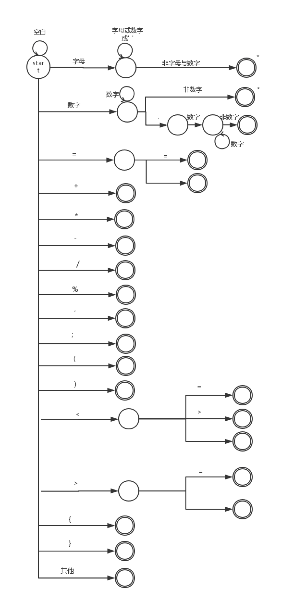
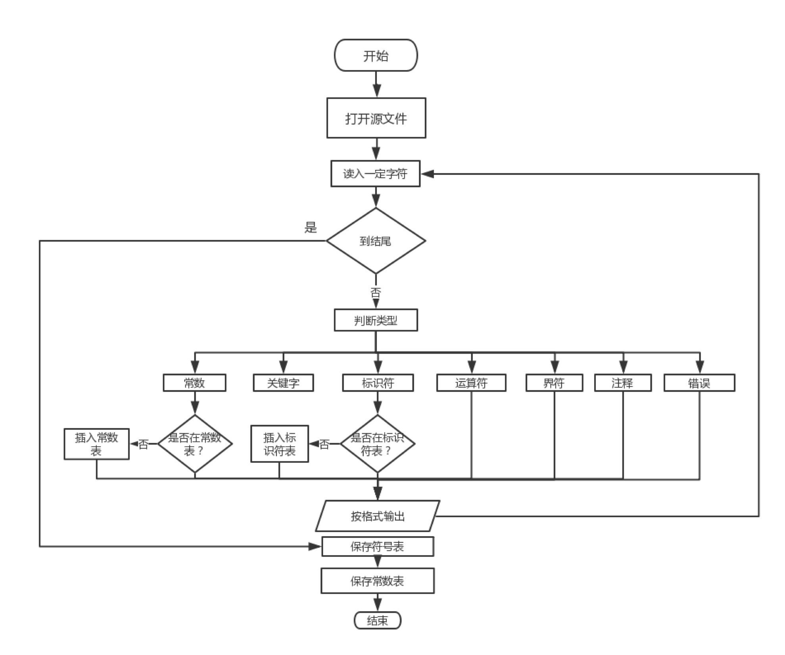

# 解释器构造实验

## CMM语言

CMM（C Minus Minus／C- -）语言为C语言的一个子集，其基础定义如下：

- 语言结构：顺序结构（赋值语句、输入、输出）、选择语句（if-else）、循环结构（while）。这些语句结构和C语言的结构一样，允许嵌套。
- 表达式局限于关系表达式和算术表达式，运算的优先级为：算术运算、关系运算，并服从左结合规则。
- 算术表达式包括整数和实数上的运算、变量及“（）”、“\*”、“+”、“-”、“/”、“%”，运算符的优先级顺序为：“（）”大于“*”和“/”和“%”大于“+”和“-”。
- 关系运算符包括：“<”、“>”、“==”、“<>”、“<=”、“>=”。 
- 一条语句以“；”结束；程序由一条语句或者由“{”和“}”嵌套表达的复合语句。
- 支持多行注释（使用“/*”、“ */”和“//”）。
- 支持数组运算，数组的下标必须是正整数，使用“[”和“]”表示数组下标。
- 数组声明方式和Java一样，如，`int[]`，可以直接通过获得数组的长度。
- 变量的使用之前需要先声明，声明的方式和C语言一样。
- 十进制的整数int与实数real，布尔类型bool。
- 标识符（由数字、字母和下划线组成的串，但必须以字母开头、且不能以下划线结尾的串）。​	
- 无类、对象的概念，函数直接定义，直接调用。

| 保留字 | 特殊符号 |
| ------ | -------- |
| if     | +        |
| else   | -        |
| while  | *        |
| read   | /        |
|        | %        |
| write  | =        |
| int    | <        |
| real   | >        |
|        | <=       |
|        | >=       |
| bool   | ==       |
|        | <>       |
|        | (        |
|        | )        |
|        | {        |
|        | }        |
|        | /*       |
|        | */       |
|        | //       |
|        | [        |
|        | ]        |
|        | ;        |
|        | ,        |

### 词法分析

#### 1. EBNF

1. \<无符号整数> : : = \<数字>{\<数字>}
2. \<无符号实数> : : = \<数字>{\<数字>}'.'\<数字>{\<数字>}
3. \<数字> : : = '0' | '1' | '2' | '3' | '4' | '5' | '6' | '7' | '8' | '9'
4. \<运算符> : : = '+' | '-' | '*' | '/' | '%' | '<' | '>' | '<>' | '==' |'=' | '<=' | '>='
5. \<界符> : : = '(' | ')' | '[' | ']' | '{' | '}' | ',' | ';'
6. \<标识符> : : = <字母> | <字母>（ <字母> | <数字> | '_' )* ( <字母> | <数字> ) +> | <#字母 : ["a"-"z","A"-"Z"]> | 
7. \<关键字> : : = <"IF": if> | <"ELSE": else> | <"WHILE": while> | <"READ": read> | <"WRITE": write> | <"INT": int> | <"REAL": real> | <"BOOL": bool> 
8. \<注释> : : = '//' | '/\*' | '*/' 

#### 2. 状态转换图



#### 3. 扫描程序框图



#### 4. 词法分析表

| 类型type            | 单词记号token     | 单词种别symbol | 种别码 |
| ------------------- | ----------------- | -------------- | ------ |
| 1    Constant 常数  | <INTEGER_LITERAL> | INTEGER        | 0      |
|                     | <REAL_LITERAL>    | REAL           | 1      |
| 2   Operator 运算符 | +                 | PLUS           | 2      |
|                     | -                 | MINUS          | 3      |
|                     | *                 | TIMES          | 4      |
|                     | /                 | DIVIDE         | 5      |
|                     | %                 | MOD            | 6      |
|                     | <                 | LESS           | 7      |
|                     | >                 | GREATER        | 8      |
|                     | <=                | LESS_EQUAL     | 9      |
|                     | >=                | MORE_EQUAL     | 10     |
|                     | <>                | NOTEQUAL       | 11     |
|                     | ==                | EQUAL          | 12     |
|                     | =                 | ASSIGN         | 13     |
| 3  Delimiter 界符   | (                 | LEFT_PAR       | 14     |
|                     | )                 | RIGHT_PAR      | 15     |
|                     | [                 | LEFT_BRA       | 16     |
|                     | ]                 | RIGHT_BRA      | 17     |
|                     | {                 | LEFT_CUR       | 18     |
|                     | }                 | RIGHT_CUR      | 19     |
|                     | ,                 | COMMA          | 20     |
|                     | ;                 | SEMI           | 21     |
| 4 标识符            | \<IDENTIFIER>     | IDENTIFIER     | 22     |
| 5 关键字            | if                | IF             | 23     |
|                     | else              | ELSE           | 24     |
|                     | while             | WHILE          | 25     |
|                     | read              | READ           | 26     |
|                     | write             | WRITE          | 27     |
|                     | int               | INT            | 28     |
|                     | real              | REAL           | 29     |
|                     | bool              | BOOL           | 30     |
| 6 注释              | //                | COMMENT        | 31     |
|                     | /*                | LEFT_COM       | 32     |
|                     | \*/               | RIGHT_COM      | 33     |
| 7 错误              |                   | ERROR          | 34     |

再加上出错类型：ERROR。


### 语法分析（EBNF）

| 类型                     | 定义为 |                                                    |
| ------------------------ | ------ | -------------------------------------------------- |
| VarDeclaration           | ::=    | Type Identifier ";"                                |
| Type                     | ::=    | Identifier                                         |
|                          |        | \| BooleanType                                     |
|                          |        | \| IntegerType                                     |
|                          |        | \| RealType                                        |
|                          |        | \|  ArrayType                                      |
| ArrayType                | ::=    | "int" "[" "]"                                      |
| ==（与Java类似）==       |        | \| "real" "[" "]"                                  |
|                          |        | \| "bool" "[" "]"                                  |
| BooleanType              | ::=    | "bool"                                             |
| IntegerType              | ::=    | "int"                                              |
| RealType              | ::=    | "real"                                              |
| Statement                | ::=    | Block                                              |
|                          |        | \|  AssignmentStatement                            |
|                          |        | \|  ArrayAssignmentStatement                       |
|                          |        | \|  IfStatement                                    |
|                          |        | \|  WhileStatement                                 |
|                          |        | \|  ReadStatement                                  |
|                          |        | \|  WriteStatement                                 |
| Block                    | ::=    | "{" ( Statement )\* "}"                            |
| AssignmentStatement      | ::=    | Identifier "=" Expression ";"                      |
| ArrayAssignmentStatement | ::=    | Identifier "[" Expression "]" "=" Expression ";"   |
| IfStatement              | ::=    | "if" "(" Expression ")" Statement "else" Statement |
| WhileStatement           | ::=    | "while" "(" Expression ")" Statement               |
| WriteStatement           | ::=    | "write" "(" Expression ")" ";"                     |
| ReadStatement            | ::=    | "read"  "(" Expression ")" ";"                     |
| Expression               | ::=    | PlusExpression                                     |
|                          |        | \| MinusExpression                                 |
|                          |        | \|  TimesExpression                                |
|                          |        | \|  DivideExpression                               |
|                          |        | \|  CompareExpression                              |
|                          |        | \|  ArrayLookup                                    |
|                          |        | \|  ArrayLength                                    |
|                          |        | \|  PrimaryExpression                              |
| CompareExpression        | ::=    | PrimaryExpression "<" PrimaryExpression            |
|                          |        | \|  PrimaryExpression ">" PrimaryExpression        |
|                          |        | \|  PrimaryExpression "<>" PrimaryExpression       |
| | | \|  PrimaryExpression "<=" PrimaryExpression |
| | | \|  PrimaryExpression ">=" PrimaryExpression |
| PlusExpression           | ::=    | PrimaryExpression "+" PrimaryExpression            |
| MinusExpression          | ::=    | PrimaryExpression "-" PrimaryExpression            |
| TimesExpression          | ::=    | PrimaryExpression "\*" PrimaryExpression           |
| DivideExpression          | ::=    | PrimaryExpression "/" PrimaryExpression           |
| ModExpression | ::= | PrimaryExpression "%" PrimaryExpression |
| ArrayLookup              | ::=    | PrimaryExpression "[" PrimaryExpression "]"        |
| ArrayLength              | ::=    | PrimaryExpression "." "length"                     |
| ExpressionList           | ::=    | Expression ( ExpressionRest )\*                    |
| ExpressionRest           | ::=    | "," Expression                                     |
| PrimaryExpression        | ::=    | IntegerLiteral                                     |
|                          |        | \|  RealLiteral                                    |
|                          |        | \|  TrueLiteral                                    |
|                          |        | \|  FalseLiteral                                   |
|                          |        | \|  BracketExpression                              |
|                          |        | \|  Identifier                                     |
| IntegerLiteral           | ::=    | <INTEGER_LITERAL>                                  |
| RealLiteral              | ::=    | <REAL_LITERAL>                                     |
| TrueLiteral              | ::=    | "true"                                             |
| FalseLiteral             | ::=    | "false"                                            |
| Identifier               | ::=    | \<IDENTIFIER>                                      |
| BracketExpression        | ::=    | "(" Expression ")"                                 |

## 测试用例
### 词法测试用例

----------
#### 1.test1(变量声明)
```
int a;
int a,b,c;
bool b;
real c;
int a[];

```

#### 2.test2(赋值语句)

```
a = 1.2;
int a[2] = k;
a = b;
```

#### 3.test3(算数运算)

```
a + 1;
a = (1 + 2) / 4 * m;
a > b;
a < b;
a <> b;
a == b;
```

#### 4.test4(if-else)

```
if(a == b){a = c;}
else if(a == b){a = b;}
else(a == b){a = b;}

```

#### 5.test5(while循环)

```
while(a<b){a = a + 1;}
```

#### 6.test6(read&write)

```
a = read(a);
write(b);
```

#### 7.test7(注释)

```
//this is the simgle line comment.
/*
this is the multiple lines comment.
*/

```
#### Error1(invalid  identifier)
```
int _a;
int a@com;


```
#### Error2(unknown keyword)
```
//unknown keywords will be recognized as indentifier
double c;
rel x;
wrote(a);
```
#### Error3(错误的数据格式) 
```
c=2.33.33;
a=7a8;
b=啊啊啊;
d=a.a;
```
#### Error4(未知的运算符号)
```
c=6^2;

```
#### Error5(错误的注释)
```
/*
this is the multiple lines comment.


```
----------

### 语法测试用例

----------


####1.test1(变量声明)
```
int a_2;
double r_2_r;
double i,j,k;
j=23;


int c = 23;
double[2] b;
b[0] = 23;
b[1] = 0;
if(b[1] == 0)
{
	real c = 23.5;
	if(c == 23.5)
		write(1);
	else
		write(0);
		
	real [1]b;
	b[0] = 0.05;
	if(b[0] == 0.05)
		write(1);
	else
		write(0);
}

/*output:
1
1
*/
```

#### 2.test2(一般变量赋值):

```
int aa,ab;
double b ,c;
aa = 23;
ab = (-4);
c =2.55;


int a = 15 - 3 * ( 150 / 3 / 10);
if(a == 0)
{
	write(1);
}
else
	write(0);


double r;
read(r);
write(r);


double r2;
r2 = 5;
int a2;
a2 = 3;
r2 = a2;
if(r2 == 3)
{
	write(1);
}
else
	write(0);

r2 = a2 ;
write(r2);
/*output:
1
233			
233.0
0
3.0
*/
```

#### 3.test3(数组):

```
double[6] doubleArray; 
int[2]  intArray ; 
double a;
a = 2.0;
int b;
b = 0;


doubleArray[b] = 2.0;
doubleArray[1] = a;
doubleArray[2] = intArray[0];
a = 0.9;
doubleArray[3] = a;
doubleArray[4] = 5.0 - 2.0 / (4.0 - 3.0) * 2.5 + 0.01; 


read(doubleArray[5]);


int x;
x = 0;
while(x < 6)
{
	write(doubleArray[x]);
	x = x + 1;
}

/*output:
23.33			#ÕâÊÇÊäÈëµÄÊý×Ö
2.0
2.0
0.0
0.9
0.01
23.33
*/
```

#### 4.test4(算术运算):

```
int a ; 
a = 2 * 4;	
if( a != 8)
	write(0);
else
	write(1);

double r ;
r = 2.0 * (3.0 - 2.10) - 0.9 * (2.50 / 1.25 );	

if( r != 0)
{
	write(0);
}
else
	write(1);

double b;
b = 4.000001;
write(b);

int x = 60 * 60 * 24 ;
int y = 60 * 60 ;
write(x / y); 

/*output:
1
0
4.000001
24
*/
```

#### 5.test5(IF-ELSE):

```
int a;
a=1;
if(a * 5 == 5)
{
  double r ;
  r = 2.0;
  if(r)
  {
	write(r);
  }
}
else
{
   a=5;
   write(a);
} 


int aa;
aa = 3;
if(aa < 4)
	if(2 < aa)
		if(aa != 3)
			write(aa);
		else
			write(aa-2);


/*output:
2.0
1
*/
```

#### 6.test6(WHILE):

```
int a;
a = 4;
while(a <> 0)
{
	write(a);
	int j=a-1;
	while(0 < j)
	{
		write(j);
		j=j-1;
	}
	a=a-1;
}
/*output:
4
3
2
1
3
2
1
2
1
1
*/
```

#### 7.test7(IF-ELSE & WHILE):

```
int a;
a = 4;
while(a != 0)
{
	int j = a;
	while(j != 0)
	{
		if(j/2 != 1)
			write(j);
		j = j-1;	
	}
	if( a < 2)
	{
		write(a);
	}
	else
		write(a+3);
	a = a -1;
}
/*output:
4
1
7
1
6
1
5
1
1
*/
```

#### 8.test8(阶乘):

```
int a;
a = 6;
int factorial;
factorial = 1;
while( a != 0 )
{
	factorial = factorial * a;
	a = a -1;
}
write( factorial );

/*output:
factorial :
720
*///:~

test9(数组排序):
double [6]R ;
	R[1] = -0.99;
	R[2] = -1.0;
	R[3] = 5.0;
	R[4] = 4.01;
	R[5] = 3.0;

	int i;
	int j;
	int swap;
  i = 6;
  while (i != 1)
  {
	    swap = 0;
      j = 1;
      while (j < i-1)
      {
		
          if ( R[j+1] < R[j])
          {
		    		swap = 1;
            R[0] = R[j];
		    		R[j] = R[j+1];
		    		R[j+1] = R[0];
          }
          j = j + 1;
       }
      i = i - 1;
	    if(swap != 1)
			i = 1;
   }

	int k = 1;
	while(k<6)
	{
		write(R[k]);
		k = k +1;
	}
/*output:
-1.0
-0.99
3.0
4.01
5.0 
*/
```

####10.test10(BREAK):

```
int a = 1;
int b = 2;
while(a<7){
  write(a);
  if(b == 4) break;
  write(b);
  a = a+1;
  b = b+1;
}
/*output:
1
2
2
3
3
*/
```

#### 11.test11(SWITCH):

```
int a = 4;
int i = 0;
switch(a)
{
   case 5:
     i = 2;
   case 4:
     i = 6;
   default:
     i = 1;

write(a);
write(i);

/*output:
4
6
*/
```

#### error1(测试标志符命名):

```
int _a;
double _a;	
int a_;		
int a@com;	

int i;
i=0;
while(i<6)
{
	write(i);
	i=i+1;
}

int i;
i=10;

/*output
报错：报错信息可能各异
*/
```

#### error2(测试数组越界和下标非法):

```
real[6] R;	
int[2] I;	

int i=0;


while(i<7)
{
	R[i] = i;
	i=i+1;
}


I[-2] = -1;

/*output:
报错：报错信息可能各异
*/
```

#### error3(测试注释嵌套和多行注释无结尾):

```
int[6] I;

int i
i=0;
while(i<6)
{
	I[i] = i;
	i=i+1;
}

/*output:
报错：报错信息可能各异
*/
```

